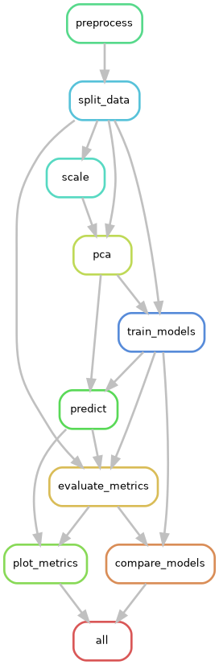
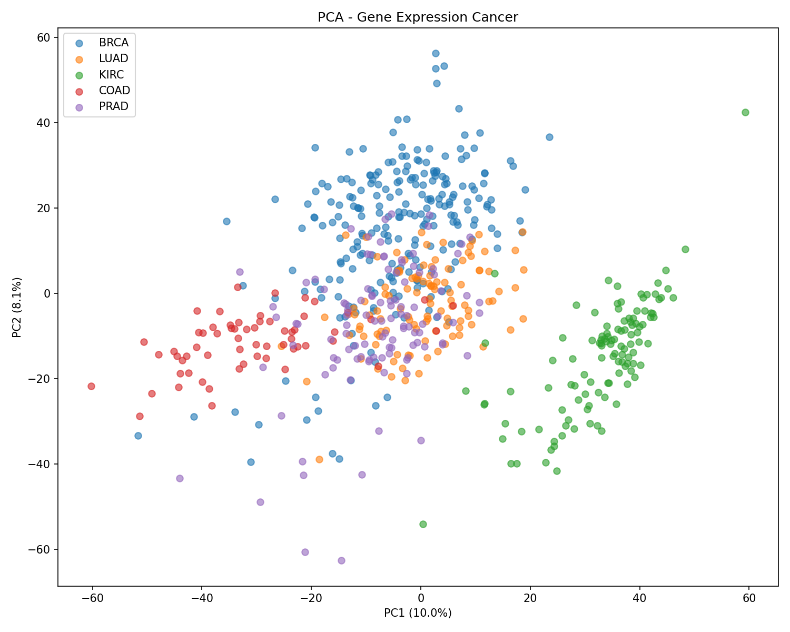
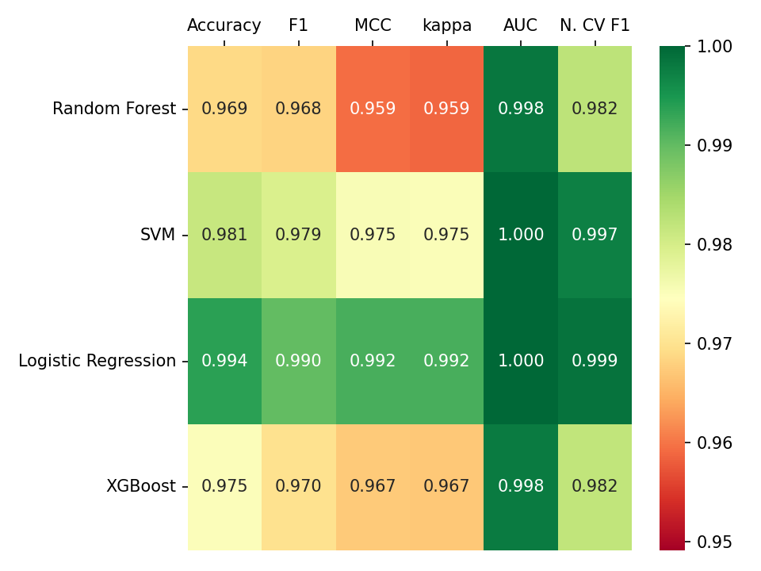
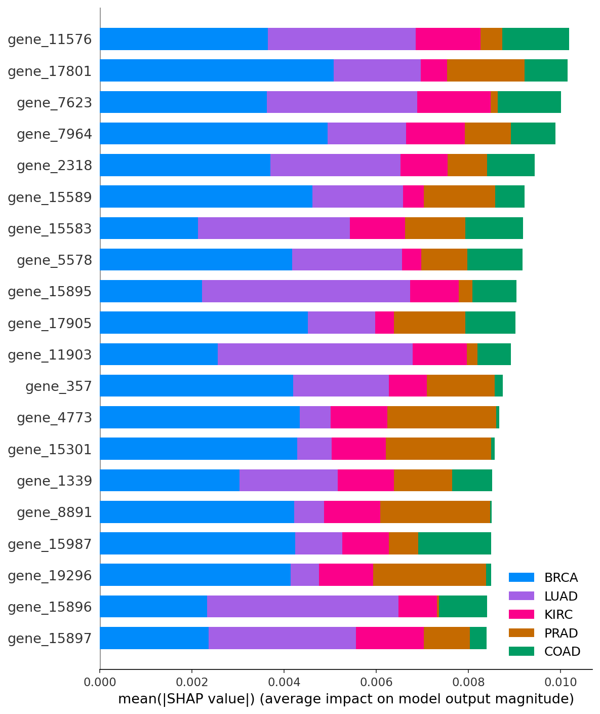

# Cancer Type Classification from Gene Expression


## Overview
This project demonstrates a fully reproducible RNA-seq analysis pipeline using Snakemake for cancer type classification based on gene expression data.
- automated preprocessing, PCA and model training pipeline
- training and evaluation of multiple machine learning models
- optional hyperparameter tuning via GridSearchCV
- SHAP-based feature importance for model interpretability
- optional nested cross-validation for unbiased model evaluation
- automated and reproducible pipeline execution

## Background
Cancer is one of the leading causes of death worldwide, with 10 million deaths in 2022 according to the WHO. Among the most common types of cancer are lung, breast, colon and rectum and prostate cancers [1]. 
Gene expression profiles can be analysed to highlight similarities and differences between cancer types. Machine learning approaches can leverage these expression patterns to classify tumour types, potentially enabling faster and more accurate diagnosis.

## Dataset
The data is part of the RNA-Seq (HiSeq) PANCAN dataset, a random extraction of gene expression profiles from 881 patients maintained by the Cancer Genome Atlas (TCGA) pan-cancer analysis project, downloaded from [kaggle](https://www.kaggle.com/datasets/waalbannyantudre/gene-expression-cancer-rna-seq-donated-on-682016). The original dataset is hosted at [Synapse](https://www.synapse.org/#!Synapse:syn4301332). Each patient is assigned one of five tumour types based on gene expression levels across 20,531 genes:

| Label | Cancer Type |
|-------|-------------|
| BRCA  | Breast invasive carcinoma |
| KIRC  | Kidney renal clear cell carcinoma |
| COAD  | Colon adenocarcinoma |
| LUAD  | Lung adenocarcinoma |
| PRAD  | Prostate adenocarcinoma |

These cancer types are known to exhibit distinct gene expression signatures, making them a suitable benchmark for classification tasks.

## Workflow
This workflow implements a fully reproducible pipeline using Snakemake as workflow management system, with all dependencies managed via conda.

```
rna-seq/
├── Snakefile
├── config/     # pipeline configuration
├── data/       # raw input data (not tracked)
├── envs/       # conda environments
├── scripts/    # Python scripts per rule
├── logs/       # Snakemake logs (not tracked)
├── benchmarks/ # Snakemake benchmarks (not tracked)
└── results/    # all pipeline outputs (not tracked)
```

After preprocessing and dimensionality reduction via Principal Component Analysis (PCA), four classification models are trained and evaluated:

| Model | Library |
|-------|---------|
| Random Forest | scikit-learn |
| Support Vector Machine (SVM) | scikit-learn |
| Logistic Regression | scikit-learn |
| XGBoost | xgboost |

The models are compared across the following metrics using a One-vs-Rest strategy:
- Accuracy
- Macro F1
- Matthews Correlation Coefficient (MCC)
- Cohen's Kappa
- Macro Area under the Curve (AUC)

### Nested Cross-Validation
In addition to the standard train/test evaluation, the pipeline optionally supports nested cross-validation (nested CV) for a more robust and less biased estimate of generalisation performance. Nested CV uses an outer loop to estimate test performance and an inner loop for hyperparameter tuning, preventing information leakage between model selection and evaluation. This is particularly useful when comparing models on a limited dataset, as it provides a more realistic estimate of how well each model would generalise to unseen data. Nested CV can be enabled in the config file via `run_nested_cv: true`.

### SHAP Feature Importance
To improve interpretability, SHAP (SHapley Additive exPlanations) values are computed for each model. The analysis is performed on the original scaled features (without PCA) to preserve gene names. Per-class beeswarm and bar plots highlight the most influential genes for each cancer type.
**Note:** For SHAP analysis, models are retrained on scaled features 
without PCA to ensure SHAP values map directly to genes rather than principal components.

### Rule graph of Snakemake workflow


## Testing
The pipeline includes a pytest suite (`tests/`) covering data preprocessing, train/test splitting, scaling, PCA and evaluation metrics. Particular focus is placed on preventing data leakage between train and test sets; dedicated tests confirm that the scaler and PCA are fit exclusively on training data and remain unaffected by test set content.

Run the test suite with:
​```
pytest tests/ -v
​```

## Results

### PCA of Gene Expression Profiles
Despite PC1 and PC2 explaining only 10.0% and 8.1% of the total variance respectively, the five cancer types form clearly distinct clusters, indicating strong biological signal in the data.



### Model Performance Comparison
After hyperparameter tuning, all models achieved strong performance across all metrics. Logistic Regression achieved the highest performance on the hold-out test set (accuracy 0.994, Macro F1 0.990), closely followed by SVM (accuracy 0.981). Random Forest and XGBoost performed slightly below, though all models exceeded 0.96 across all metrics. Nested cross-validation F1 scores (see [Nested Cross-Validation](#nested-cross-validation)) are closely aligned with hold-out performance across all models, suggesting that the results are robust and not an artefact of a favourable train/test split. The high performance across all models reflects the strong separability of the five cancer types in gene expression space, consistent with the distinct cluster structure visible in the PCA plot. As this is a single dataset without external validation, results should be interpreted with caution.



### SHAP Feature Importance

The SHAP summary plot shows the most influential genes across all five cancer types. gene_17801 is the strongest predictor for BRCA, while gene_15896 dominates KIRC classification.
**Note:** Gene IDs will be mapped to HGNC gene names in a future update.




## Limitations
- **Single dataset without external validation:** All models are trained and evaluated on one dataset. Performance may not generalise to other cohorts or sequencing protocols.
- **Simplified problem setting:** The selected cancer types are known to be well-separated in gene expression space, making this a relatively easy classification task compared to real-world scenarios.
- **Minor tuning/training mismatch:** During hyperparameter tuning and 
nested CV, PCA is refit independently within each CV fold (on a subset of the training data) to prevent leakage between folds. The final model, however, is trained using PCA fitted once on the entire training set. This means selected hyperparameters are optimised for a slightly 
different PCA fit than the one used in final training; this is a minor inconsistensy rather than a source of data leakage.
- **PCA information loss:** Dimensionality reduction to 50 components retains only a fraction of total variance, potentially discarding relevant signal.

## Usage
**Requirements:** conda and snakemake ([installation guide](https://snakemake.readthedocs.io/en/stable/getting_started/installation.html)) must be installed.

Clone the repository and navigate to the project directory:
```bash
git clone https://github.com/shmuen/rna-seq
cd rna-seq
```

The workflow manages all dependencies automatically via conda. Run with:
```bash
snakemake --cores N --use-conda
```
Replace `N` with the number of cores to use.

Hyperparameter tuning as well as nested cross-validation is optional and can be enabled independently in the config file:

```yaml
tuning:
  enabled: true   
# enable hyperparameter tuning via GridSearchCV

run_nested_cv: true  
# enable nested cross-validation for unbiased performance estimates
```

To run only specific models, adjust the `model` parameter in `config.yaml`:

```yaml
model: ["randomforest", "svm", "logistic_regression", "xgboost"]
# to run a single model: model: ["randomforest"]
```

## References
[1] Ferlay J, Ervik M, Lam F, Colombet M, Mery L, Piñeros M, et al. Global Cancer Observatory: Cancer Today. Lyon: International Agency for Research on Cancer; 2022 (https://gco.iarc.fr/today, accessed April 2026). 